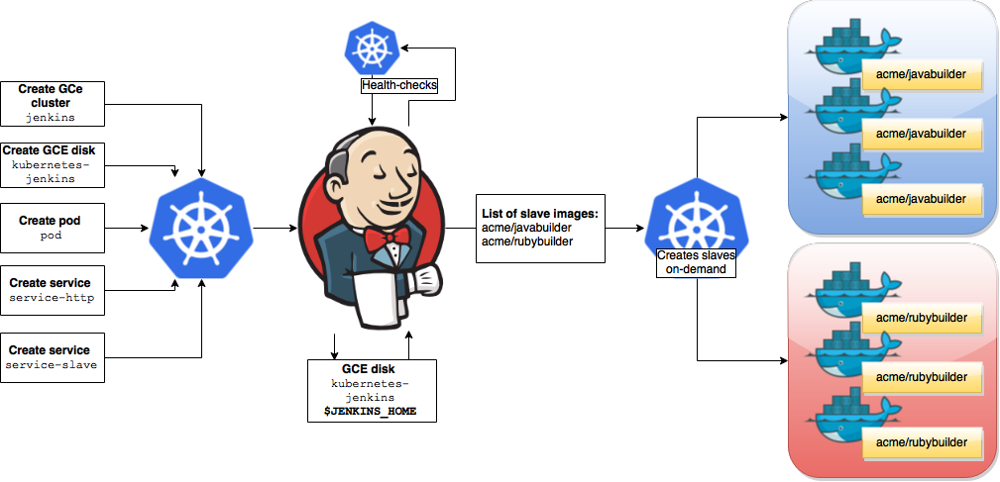
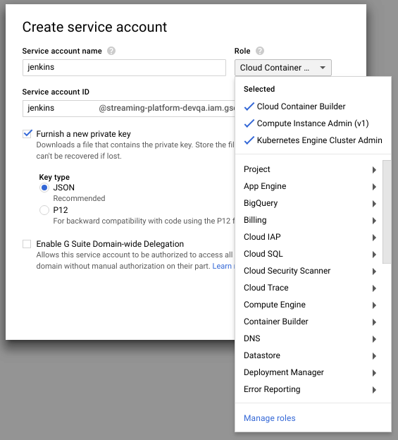

<!--
#                                 __                 __
#    __  ______  ____ ___  ____ _/ /____  ____  ____/ /
#   / / / / __ \/ __ `__ \/ __ `/ __/ _ \/ __ \/ __  /
#  / /_/ / /_/ / / / / / / /_/ / /_/  __/ /_/ / /_/ /
#  \__, /\____/_/ /_/ /_/\__,_/\__/\___/\____/\__,_/
# /____                     matthewdavis.io, holla!
#
#-->

[](https://k8.matthewdavis.io)
[](https://twitter.com/yomateod) [](skype:appsoa?chat)

# Deploy Jenkins with a `make install`

Don't forget to button things up with https://github.com/mateothegreat/k8-byexamples-cert-manager and get fancy with https://github.com/mateothegreat/k8-byexamples-keycloak!



This deployment uses my custom docker image with Jenkins built on alpine inlcuding gradle & gcloud sdk (https://github.com/mateothegreat/docker-alpine-jenkins-gcloud).
## Usage

```sh
$ make help
  
                                  __                 __
     __  ______  ____ ___  ____ _/ /____  ____  ____/ /
    / / / / __ \/ __  __ \/ __  / __/ _ \/ __ \/ __  / 
   / /_/ / /_/ / / / / / / /_/ / /_/  __/ /_/ / /_/ /  
   \__, /\____/_/ /_/ /_/\__,_/\__/\___/\____/\__,_/   
  /____                                                
                          yomateo.io, it ain't easy.   
  
  Usage: make <target(s)>
  
  Targets:
  
    create-disk          Create persistent disk
    secret-create        Create secret with service_account.json for Google Cloud Platform
    password             Retrieve temporary password from /var/jenkins_home/secrets/initialAdminPassword
    openid-fix           Update config.xml https://github.com/jenkinsci/oic-auth-plugin/issues/7
    dump/submodules      Output list of submodules & repositories
    install              Installs manifests to kubernetes using kubectl apply (make manifests to see what will be installed)
    delete               Deletes manifests to kubernetes using kubectl delete (make manifests to see what will be installed)
    get                  Retrieves manifests to kubernetes using kubectl get (make manifests to see what will be installed)
    get/all              Retrives all resources (in color!)
    describe             Describes manifests to kubernetes using kubectl describe (make manifests to see what will be installed)
    context              Globally set the current-context (default namespace)
    shell                Grab a shell in a running container
    dump/logs            Find first pod and follow log output
    dump/manifests       Output manifests detected (used with make install, delete, get, describe, etc)
  
  Tools:
  
    get/myip              Get your external ip
    testing-curl          Try to curl http & https from $(HOST)
    testing/curlhttp      Try to curl http://$(HOST)
    testing/curlhttps     Try to curl https://$(HOST)
    testing/getip         Retrieve external IP from api.ipify.org
    git/update            Update submodule(s) to HEAD from origin
    git/up                Update all .make submodules
    rbac/grant-google     Create clusterrolebinding for cluster-admin

```

## Installation

### Setup Google Cloud Platform Access (optional)
Create a service account with at least the following permissions:



Place your service account json in a file named service_account.json in the root directory of this repository.
Create the secret:

```bash
$ make secret-create
 
  kubectl create secret generic gcloud-jenkins -n default --from-file service_account.json
  secret "gcloud-jenkins" created
```

### Create Persistent Disk

```bash
$ make create-disk
  
  gcloud compute disks create jenkins-persistent-storage --zone us-central1-a --size 10
  
  Created [https://www.googleapis.com/compute/v1/projects/streaming-platform-devqa/zones/us-central1-a/disks/jenkins-persistent-storage].
  
  NAME                        ZONE           SIZE_GB  TYPE         STATUS
  jenkins-persistent-storage  us-central1-a  10       pd-standard  READY
```

### `make install`

```bash
$ make install
  
  [ INSTALLING MANIFESTS/STORAGE-PERSISTENTVOLUMECLAIM.YAML ]: persistentvolumeclaim "jenkins-persistent-storage" created
  [ INSTALLING MANIFESTS/STORAGE-PERSISTENTVOLUME.YAML ]: persistentvolume "jenkins-persistent-storage" created
  [ INSTALLING MANIFESTS/SERVICE.YAML ]: service "jenkins" created
  [ INSTALLING MANIFESTS/DEPLOYMENT.YAML ]: deployment "jenkins" created
```

### Get the initial password

```bash

$ make password 
kubectl exec jenkins-deployment-7449f6d84f-pkq52 -it -- cat /var/jenkins_home/secrets/initialAdminPassword

<password will be output here>
```
## Cleanup

This will cleanup your kubernetes resources only (it will not remove your persistent disk):

```bash
$ make delete
  
  [ DELETING MANIFESTS/STORAGE-PERSISTENTVOLUMECLAIM.YAML ]: persistentvolumeclaim "jenkins-persistent-storage" deleted
  [ DELETING MANIFESTS/STORAGE-PERSISTENTVOLUME.YAML ]: persistentvolume "jenkins-persistent-storage" deleted
  [ DELETING MANIFESTS/SERVICE.YAML ]: service "jenkins" deleted
  [ DELETING MANIFESTS/DEPLOYMENT.YAML ]: deployment "jenkins" deleted
```

## See also
* Terminal SSL at an ingress controller with LetsEncrypt: https://github.com/mateothegreat/k8-byexamples-ingress-controller
* Learn more about my `.make` library: https://github.com/mateothegreat/.make
* Use identity management with: https://github.com/mateothegreat/k8-byexamples-keycloak
* Check out my other Kubernetes By Example repositories: https://github.com/mateothegreat?tab=repositories&q=k8-byexamples
* Image snagged from: https://www.cloudbees.com/blog/clustering-jenkins-kubernetes-google-container-engine